<p align="center">
  
</p>

<h1 align="center">🕌 Quran Pesat</h1>

<p align="center">
  <b>Aplikasi Islami lengkap untuk menemani ibadah harian Anda</b><br/>
  <sub>Dibuat dengan ❤️ untuk umat Muslim</sub>
</p>

<p align="center">
  
  
  
  
</p>

---

## ✨ Tentang Aplikasi

**Quran Pesat** adalah aplikasi mobile berbasis React Native (Expo) yang dirancang untuk membantu umat Muslim dalam menjalankan ibadah sehari-hari. Aplikasi ini menyediakan berbagai fitur islami dalam satu tempat dengan tampilan yang modern, bersih, dan nyaman digunakan.

---

## 📱 Fitur Utama

| Fitur | Deskripsi |
|-------|-----------|
| 📖 **Al-Quran** | Baca Al-Quran lengkap 114 surat dengan terjemahan Bahasa Indonesia |
| 🤲 **Doa Harian** | Kumpulan doa sehari-hari lengkap dengan teks Arab dan artinya |
| 📿 **Dzikir** | Dzikir pagi, sore, dan setelah sholat dengan penghitung |
| 📜 **Hadits** | Koleksi hadits shahih dari berbagai perawi |
| 🕋 **Arah Kiblat** | Penunjuk arah kiblat menggunakan Google Qibla Finder |
| 🕐 **Jadwal Sholat** | Waktu sholat otomatis berdasarkan lokasi |
| 🤖 **Asisten AI Islami** | Chatbot AI yang menjawab pertanyaan seputar Islam (Gemini API) |
| 📛 **Asmaul Husna** | 99 nama-nama Allah beserta arti dan latinnya |
| 🗓️ **Kalender Hijriah** | Kalender Islam dengan konversi tanggal |
| 🧮 **Kalkulator Zakat** | Hitung zakat fitrah & zakat maal dengan mudah |
| 🔔 **Notifikasi** | Pengaturan pengingat sholat & baca Al-Quran |
| 💰 **Donasi** | Halaman dukungan untuk pengembangan aplikasi |
| ⚙️ **Pengaturan** | Kelola preferensi aplikasi |

---

## 🖼️ Tampilan Aplikasi

### Halaman Utama
| Beranda | Al-Quran | Artikel | Pengaturan |
|:---:|:---:|:---:|:---:|
| 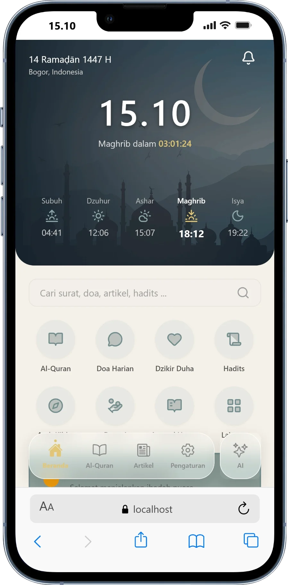 | 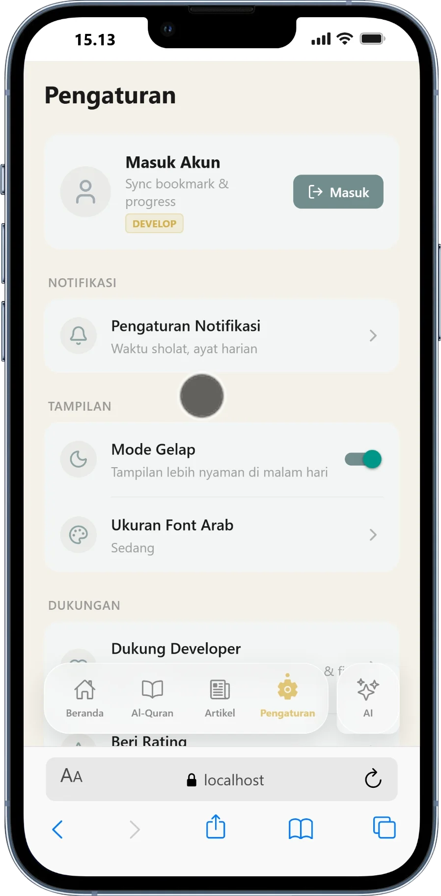 | 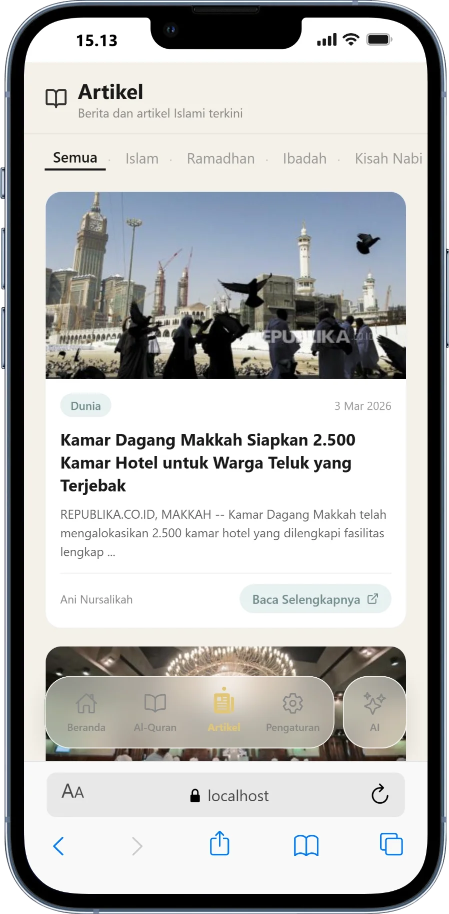 | 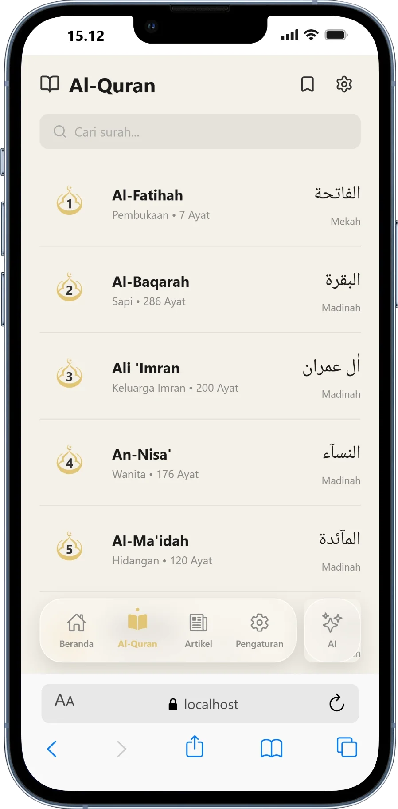 |

### Fitur Islami
| Baca Surat | Doa Harian | Detail Doa | Hadits |
|:---:|:---:|:---:|:---:|
| 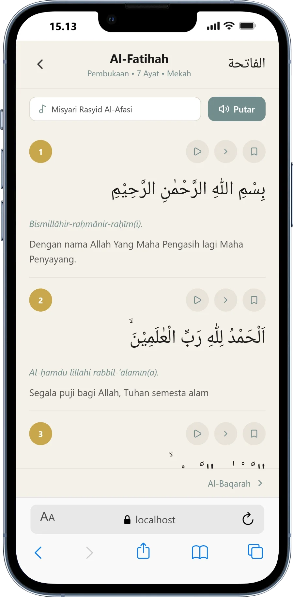 | 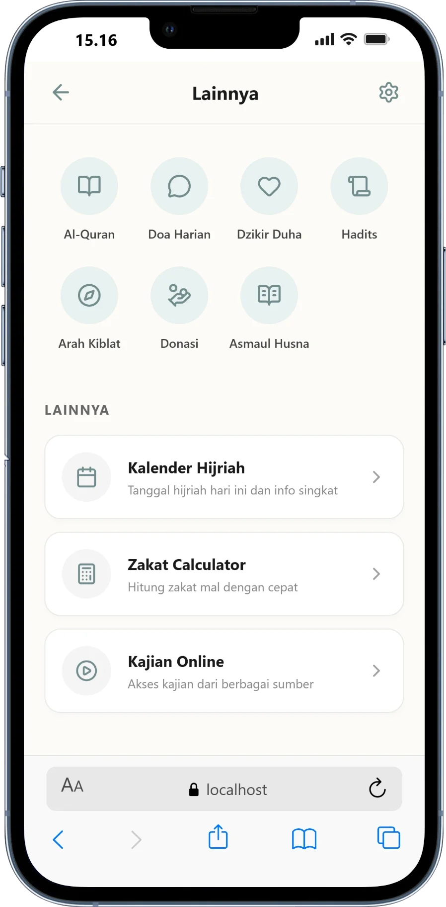 | 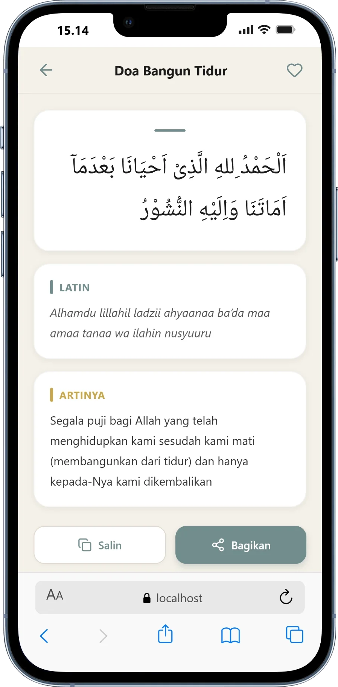 | 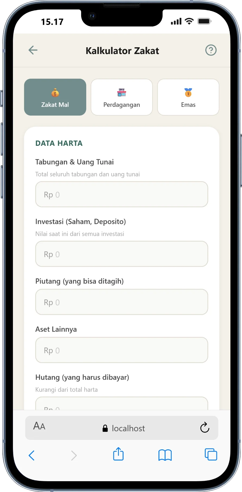 |

### Fitur Tambahan
| Dzikir | Asmaul Husna | Kalender Hijriah | Kalkulator Zakat |
|:---:|:---:|:---:|:---:|
| 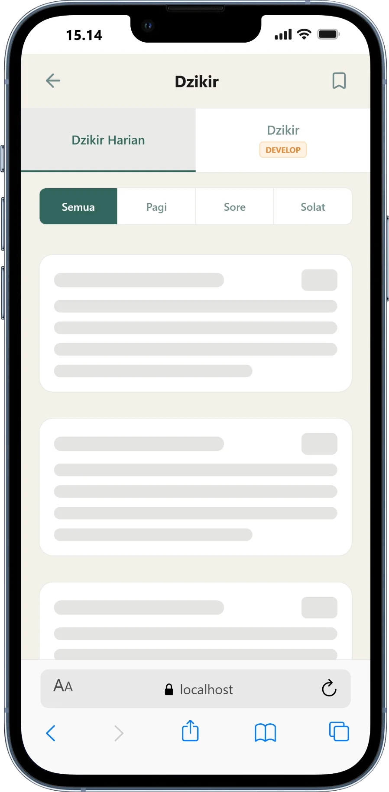 | 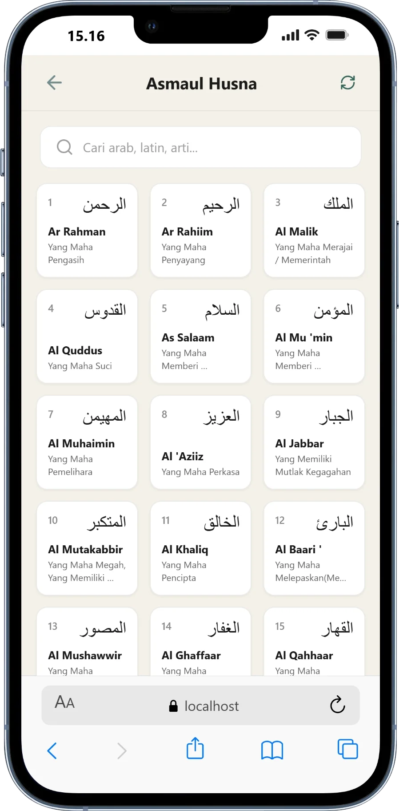 | 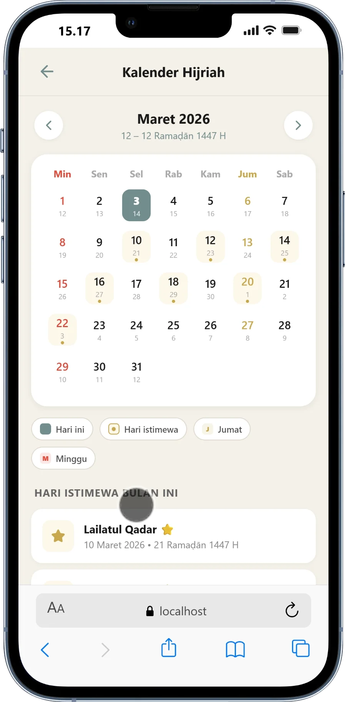 | 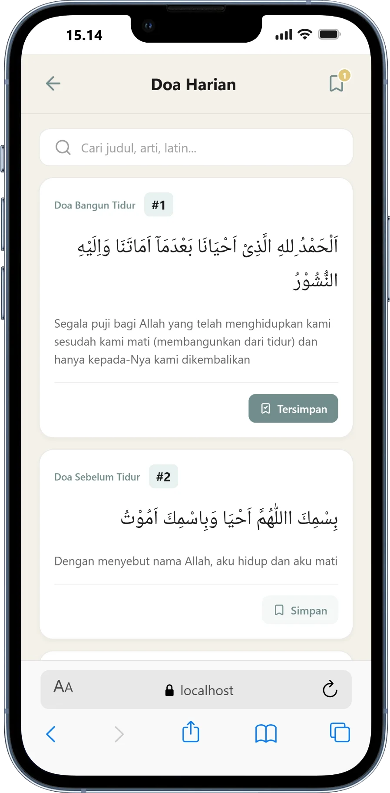 |

### AI & Lainnya
| Asisten AI | Detail Hadits | Notifikasi | Lainnya |
|:---:|:---:|:---:|:---:|
| 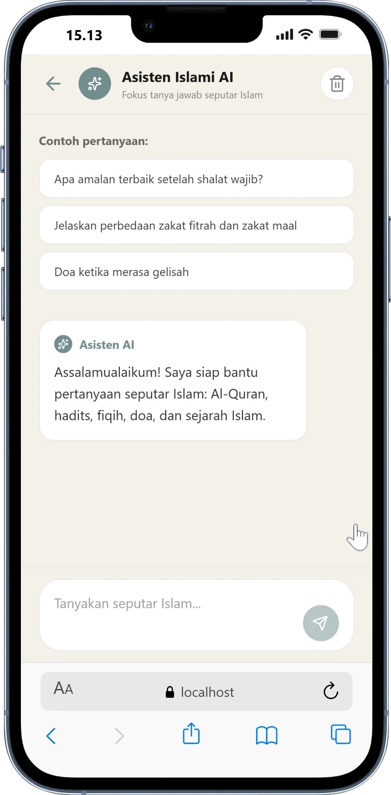 | 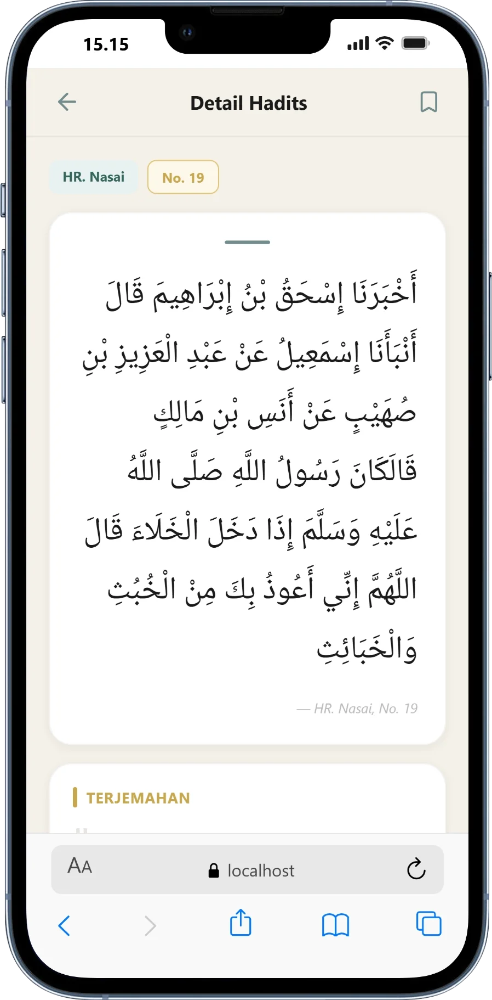 | 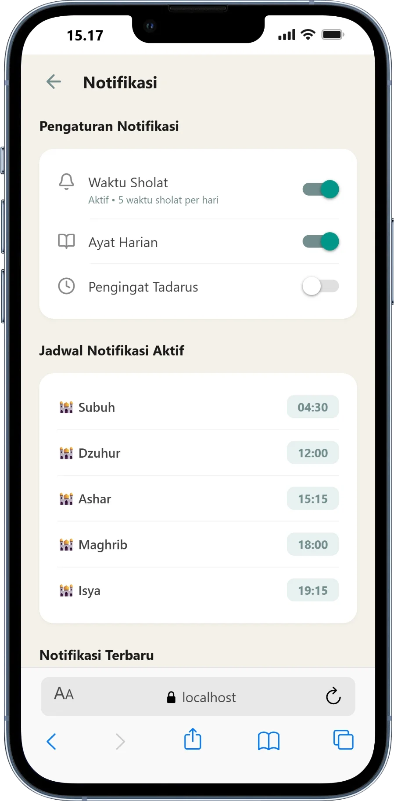 | 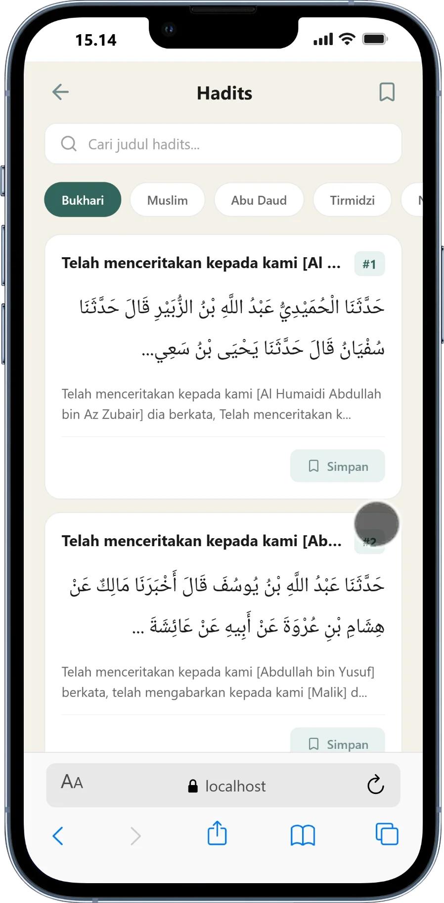 |

---

## 🛠️ Tech Stack

- **Framework:** React Native + Expo (SDK 52)
- **Routing:** Expo Router (File-based routing)
- **Bahasa:** TypeScript
- **AI Engine:** Google Gemini API
- **API Islami:** [Aladhan API](https://aladhan.com/prayer-times-api), [Al-Quran Cloud API](https://alquran.cloud/api)
- **Arah Kiblat:** [Google Qibla Finder](https://qiblafinder.withgoogle.com/)
- **Icons:** Lucide React Native
- **UI Framework:** React Native Safe Area Context, Expo Blur

---

## 🚀 Cara Menjalankan

### Prasyarat
- [Node.js](https://nodejs.org/) (v18+)
- [Expo CLI](https://docs.expo.dev/get-started/installation/)
- [Expo Go](https://expo.dev/go) di HP Android/iOS

### Langkah Instalasi

```bash
# 1. Clone repository
git clone https://github.com/Bimakanz/QuranApp.git

# 2. Masuk ke folder project
cd QuranApp

# 3. Install dependencies
npm install

# 4. Jalankan aplikasi
npx expo start
```

Scan QR code yang muncul di terminal menggunakan aplikasi **Expo Go** di HP kamu.

---

## 🔑 Konfigurasi API Key (Opsional)

Untuk mengaktifkan fitur **Asisten AI Islami**, kamu perlu API Key dari Google Gemini:

1. Buka [Google AI Studio](https://aistudio.google.com/)
2. Buat API Key gratis
3. Buka file `app/(tabs)/AI.tsx`
4. Masukkan key di variabel `GEMINI_API_KEY`

```typescript
const GEMINI_API_KEY = 'YOUR_API_KEY_HERE';
```

---

## 📁 Struktur Project

```
QuranApp/
├── app/
│   ├── (tabs)/              # Tab navigation screens
│   │   ├── Home.tsx         # Beranda utama
│   │   ├── AlQuran.tsx      # Halaman Al-Quran
│   │   ├── Artikel.tsx      # Halaman Artikel
│   │   ├── Pengaturan.tsx   # Pengaturan aplikasi
│   │   ├── AI.tsx           # Asisten AI Islami
│   │   └── _layout.tsx      # Tab layout & floating navbar
│   ├── ArahKiblat.tsx       # Google Qibla Finder
│   ├── AsmaulHusna.tsx      # 99 Asmaul Husna
│   ├── DoaHarian.tsx        # Kumpulan doa harian
│   ├── Dzikir.tsx           # Dzikir pagi, sore, sholat
│   ├── Hadits.tsx           # Koleksi hadits
│   ├── KalenderHijrah.tsx   # Kalender Hijriah
│   ├── KalkulatorZakat.tsx  # Kalkulator zakat
│   ├── Notifikasi.tsx       # Pengaturan notifikasi
│   ├── Donasi.tsx           # Halaman donasi
│   ├── Lainnya.tsx          # Menu tambahan
│   └── ...
├── assets/                  # Gambar & aset
├── app.json                 # Konfigurasi Expo
└── package.json             # Dependencies
```

---

## 👨‍💻 Developer

Dikembangkan secara individu dengan penuh dedikasi.

> *"Sebaik-baik manusia adalah yang paling bermanfaat bagi manusia lainnya."*
> — HR. Ahmad, ath-Thabrani, ad-Daruqutni

---

## 📄 Lisensi

Project ini dilisensikan di bawah [MIT License](LICENSE).

---

<p align="center">
  <b>Quran Pesat v1.0.0</b><br/>
  <sub>Made with ❤️ for Muslims</sub>
</p>
